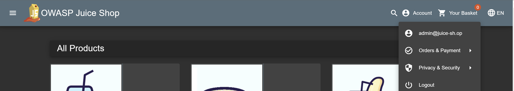

# Juice-Shop: Login Admin

1. Memakai Burp Suite, maka permintaan HTTP POST yang dikirim selama upaya login normal berhasil dicegat. Permintaan ini menyertakan kredensial pengguna dalam bentuk data JSON.

2. Masukkan email dan dilanjutkan payload, Mengubah bidang email dalam menjadi admin@juice-sh.op' OR '1'='1' --, yang secara efektif mengubah perintah SQL menjadi pernyataan yang selalu mengembalikan nilai true, sehingga tidak perlu kata sandi.
   

3. Berhasil masuk sebagai admin, kondisi OR '1'='1'selalu bernilai benar, yang memungkinkan akses tidak sah ke akun administrator.
   Penjelasan Solusi
   
