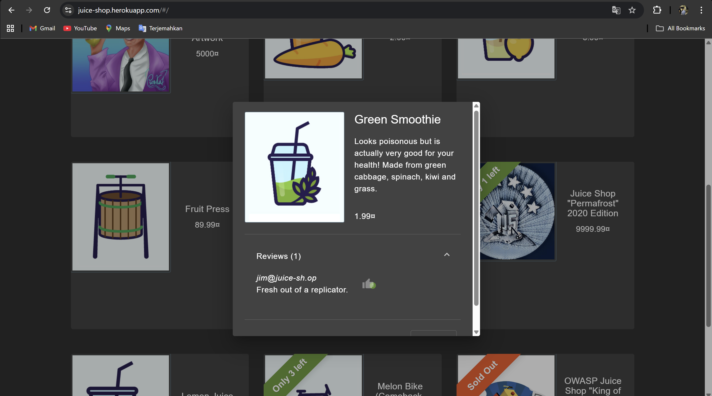
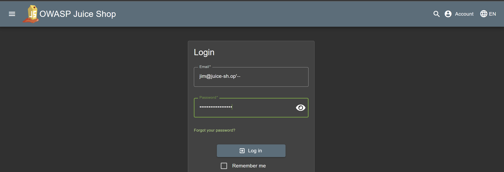
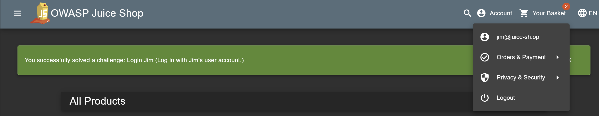

# Juice-Shop: Login Jim

1. Mengscanning mencari email yang ada unsur jim
   

2. Masukkan perintah SQL yang telah dibuat ke dalam kolom nama pengguna atau kata sandi yang mengubah kueri SQL backend agar selalu bernilai benar. Payload SQLi umum digunakan '-- untuk memanipulasi kueri SQL.
   

3. Berhasil masuk sebagai Jim, kondisi OR '1'='1'selalu bernilai benar, yang memungkinkan akses tidak sah ke akun Jim.
   
